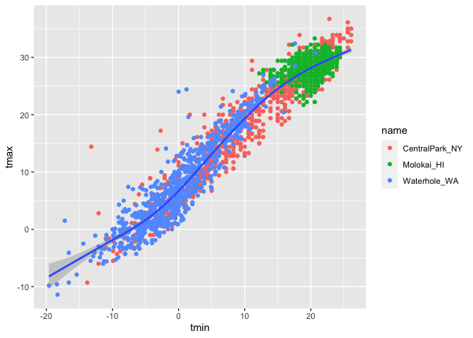
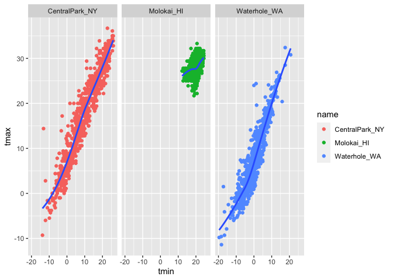
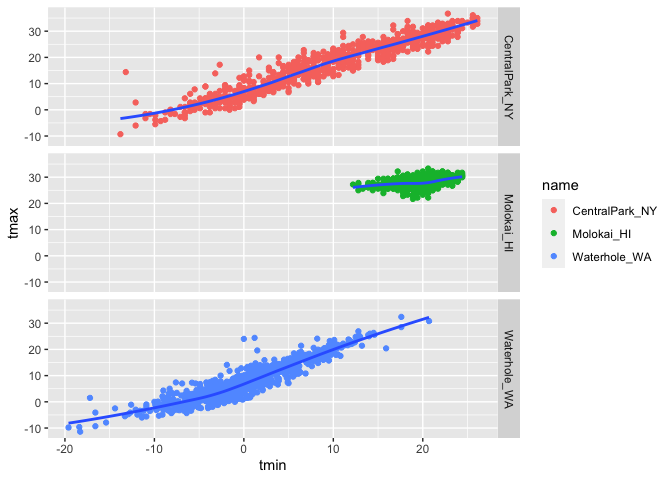
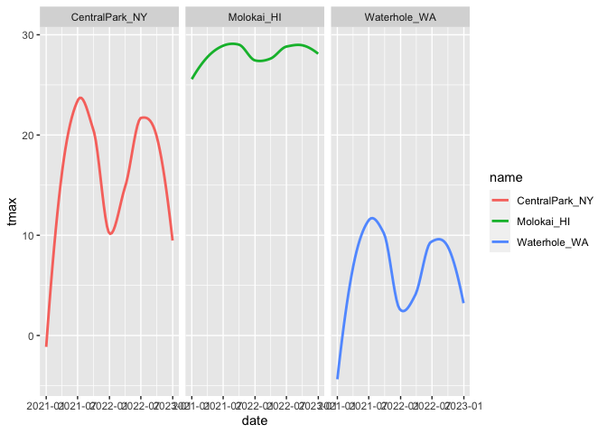
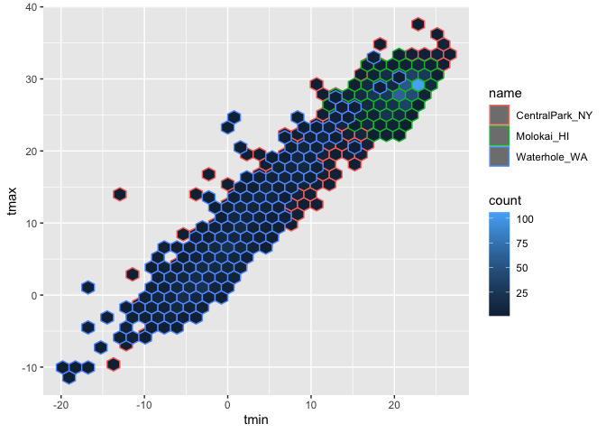
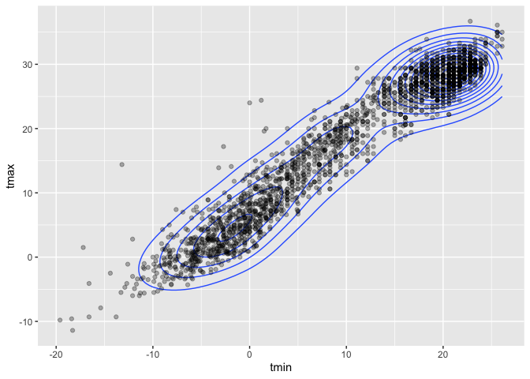
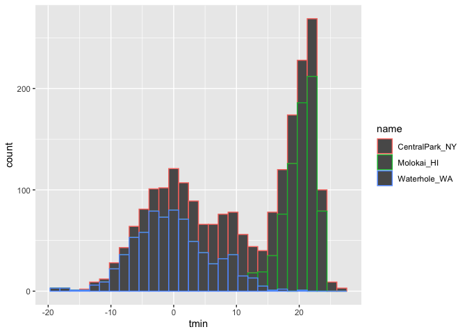
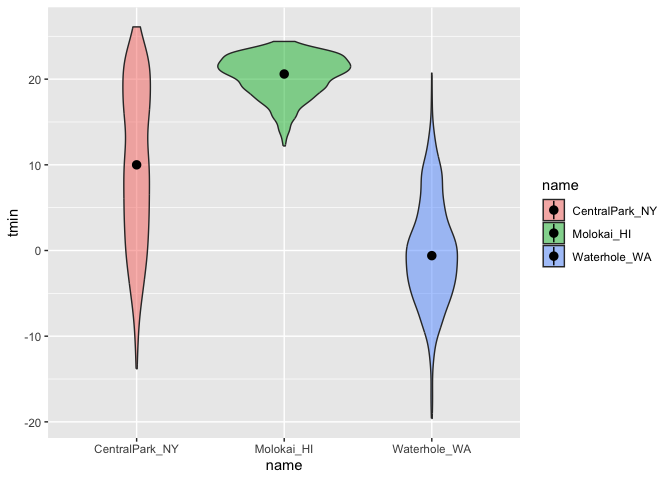
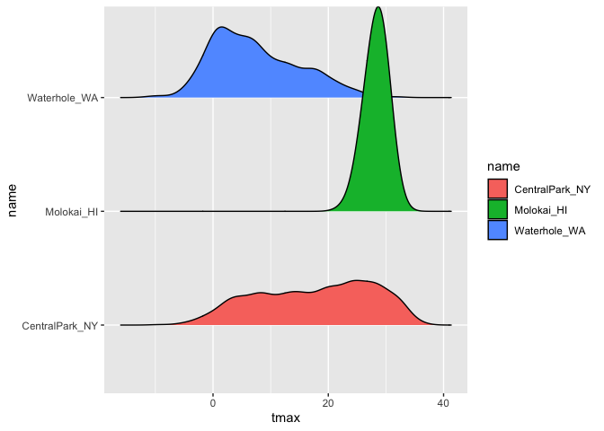
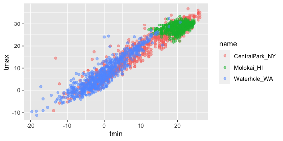

Visualization with ggplot
================
Esther Kyeremah
2023-10-22

``` r
library(tidyverse)
```

    ## ── Attaching core tidyverse packages ──────────────────────── tidyverse 2.0.0 ──
    ## ✔ dplyr     1.1.3     ✔ readr     2.1.4
    ## ✔ forcats   1.0.0     ✔ stringr   1.5.0
    ## ✔ ggplot2   3.4.3     ✔ tibble    3.2.1
    ## ✔ lubridate 1.9.2     ✔ tidyr     1.3.0
    ## ✔ purrr     1.0.2     
    ## ── Conflicts ────────────────────────────────────────── tidyverse_conflicts() ──
    ## ✖ dplyr::filter() masks stats::filter()
    ## ✖ dplyr::lag()    masks stats::lag()
    ## ℹ Use the conflicted package (<http://conflicted.r-lib.org/>) to force all conflicts to become errors

``` r
library(ggridges)
```

``` r
weather_df = 
  rnoaa::meteo_pull_monitors(
    c("USW00094728", "USW00022534", "USS0023B17S"),
    var = c("PRCP", "TMIN", "TMAX"), 
    date_min = "2021-01-01",
    date_max = "2022-12-31") |>
  mutate(
    name = recode(
      id, 
      USW00094728 = "CentralPark_NY", 
      USW00022534 = "Molokai_HI",
      USS0023B17S = "Waterhole_WA"),
    tmin = tmin / 10,
    tmax = tmax / 10) |>
  select(name, id, everything())
```

    ## using cached file: /Users/ESTER1/Library/Caches/org.R-project.R/R/rnoaa/noaa_ghcnd/USW00094728.dly

    ## date created (size, mb): 2023-10-22 18:36:33.146851 (8.534)

    ## file min/max dates: 1869-01-01 / 2023-10-31

    ## using cached file: /Users/ESTER1/Library/Caches/org.R-project.R/R/rnoaa/noaa_ghcnd/USW00022534.dly

    ## date created (size, mb): 2023-10-22 18:37:04.899569 (3.839)

    ## file min/max dates: 1949-10-01 / 2023-10-31

    ## using cached file: /Users/ESTER1/Library/Caches/org.R-project.R/R/rnoaa/noaa_ghcnd/USS0023B17S.dly

    ## date created (size, mb): 2023-10-22 18:37:14.53003 (0.997)

    ## file min/max dates: 1999-09-01 / 2023-10-31

\##Scatterplts!! Create my first scatterplot

``` r
weather_df |>
ggplot(aes(x = tmin, y = tmax)) + 
  geom_point()
```

    ## Warning: Removed 17 rows containing missing values (`geom_point()`).

<!-- -->

Save and edit a plot object

``` r
weather_plot=
weather_df |>
ggplot(aes(x = tmin, y = tmax)) 

weather_plot + geom_point()
```

    ## Warning: Removed 17 rows containing missing values (`geom_point()`).

<!-- -->

\##Advanced scatterplot.. Start with th

``` r
weather_df |>
ggplot(aes(x = tmin, y = tmax, color = name)) + 
  geom_point() +
  geom_smooth(se = FALSE)
```

    ## `geom_smooth()` using method = 'loess' and formula = 'y ~ x'

    ## Warning: Removed 17 rows containing non-finite values (`stat_smooth()`).

    ## Warning: Removed 17 rows containing missing values (`geom_point()`).

<!-- -->

What aout the aes

``` r
weather_df |>
ggplot(aes(x = tmin, y = tmax)) + 
  geom_point(aes(color = name)) +
  geom_smooth()
```

    ## `geom_smooth()` using method = 'gam' and formula = 'y ~ s(x, bs = "cs")'

    ## Warning: Removed 17 rows containing non-finite values (`stat_smooth()`).

    ## Warning: Removed 17 rows containing missing values (`geom_point()`).

<!-- -->

Let’s facet some things!!

``` r
weather_df |>
ggplot(aes(x = tmin, y = tmax)) + 
  geom_point(aes(color = name)) +
  geom_smooth(se = FALSE) +
  facet_grid(. ~ name)
```

    ## `geom_smooth()` using method = 'loess' and formula = 'y ~ x'

    ## Warning: Removed 17 rows containing non-finite values (`stat_smooth()`).

    ## Warning: Removed 17 rows containing missing values (`geom_point()`).

<!-- -->

``` r
weather_df |>
ggplot(aes(x = tmin, y = tmax)) + 
  geom_point(aes(color = name)) +
  geom_smooth(se = FALSE) +
  facet_grid(name ~ .)
```

    ## `geom_smooth()` using method = 'loess' and formula = 'y ~ x'

    ## Warning: Removed 17 rows containing non-finite values (`stat_smooth()`).

    ## Warning: Removed 17 rows containing missing values (`geom_point()`).

<!-- -->

Define alpha(here it means size/transparency) level

``` r
weather_df |>
ggplot(aes(x = tmin, y = tmax, color = name)) + 
  geom_point(alpha = .2, size = .3) +
  geom_smooth(se = FALSE) +
  facet_grid(. ~ name)
```

    ## `geom_smooth()` using method = 'loess' and formula = 'y ~ x'

    ## Warning: Removed 17 rows containing non-finite values (`stat_smooth()`).

    ## Warning: Removed 17 rows containing missing values (`geom_point()`).

<!-- -->
Lets try a new pkot with date

``` r
weather_df |>
ggplot(aes(x = date, y = tmax, color = name)) + 
  geom_point(aes(size = prcp),alpha = .5) +
  geom_smooth(se = FALSE) +
  facet_grid(. ~ name)
```

    ## `geom_smooth()` using method = 'loess' and formula = 'y ~ x'

    ## Warning: Removed 17 rows containing non-finite values (`stat_smooth()`).

    ## Warning: Removed 19 rows containing missing values (`geom_point()`).

<!-- -->

How many geoms have to exist? you can have whatever geoms you want but
below may not be useful

``` r
weather_df |>
ggplot(aes(x = date, y = tmax, color = name)) + 
  geom_smooth(se = FALSE) +
  facet_grid(. ~ name)
```

    ## `geom_smooth()` using method = 'loess' and formula = 'y ~ x'

    ## Warning: Removed 17 rows containing non-finite values (`stat_smooth()`).

<!-- -->

You can use a neat geom! this is overkill for a scatterplot with 1000
observations but for very large datasets this helps tbecause changing
your alpha in those cases sometimes doesnt help to see

``` r
weather_df |>
ggplot(aes(x = tmin, y = tmax, color = name)) + 
  geom_hex()
```

    ## Warning: Removed 17 rows containing non-finite values (`stat_binhex()`).

<!-- -->

adding on geom density

``` r
weather_df |>
ggplot(aes(x = tmin, y = tmax)) + 
geom_density2d() +
geom_point(alpha = .3)
```

    ## Warning: Removed 17 rows containing non-finite values (`stat_density2d()`).

    ## Warning: Removed 17 rows containing missing values (`geom_point()`).

<!-- -->

\##univariate plots

``` r
weather_df |>
ggplot(aes(x = tmin)) +
  geom_histogram()
```

    ## `stat_bin()` using `bins = 30`. Pick better value with `binwidth`.

    ## Warning: Removed 17 rows containing non-finite values (`stat_bin()`).

<!-- -->

when you want to add color

``` r
weather_df |>
ggplot(aes(x = tmin, color = name)) +
  geom_histogram()
```

    ## `stat_bin()` using `bins = 30`. Pick better value with `binwidth`.

    ## Warning: Removed 17 rows containing non-finite values (`stat_bin()`).

<!-- -->

DOESNT LOOK TOO GOOD COS THEYRE JUST STACKED ON EACH OTHER AND THE COLOR
IS ON THE OUTSIDE OF THE BAR

``` r
weather_df |>
ggplot(aes(x = tmin, fill = name)) +
  geom_histogram(position = "dodge")
```

    ## `stat_bin()` using `bins = 30`. Pick better value with `binwidth`.

    ## Warning: Removed 17 rows containing non-finite values (`stat_bin()`).

<!-- -->

EVEN THOUGH THEYRE NOT REALLY STACKED THE DODGE DOESNT STILL MAKE IT TOO
REPRESNTABLE

so..

``` r
weather_df |>
ggplot(aes(x = tmin, fill = name)) +
geom_histogram() +
  facet_grid(. ~ name)
```

    ## `stat_bin()` using `bins = 30`. Pick better value with `binwidth`.

    ## Warning: Removed 17 rows containing non-finite values (`stat_bin()`).

<!-- -->

Let’s try a new geometry! this one makes you see more or less bumps in
the histogram

``` r
weather_df |>
ggplot(aes(x = tmin, fill = name)) +
geom_density(alpha = .3, adjust = .5)
```

    ## Warning: Removed 17 rows containing non-finite values (`stat_density()`).

<!-- -->

Lets try box plots

``` r
weather_df |>
ggplot(aes(x = name, y = tmin)) +
geom_boxplot()
```

    ## Warning: Removed 17 rows containing non-finite values (`stat_boxplot()`).

<!-- -->

Trendy plots

``` r
weather_df |>
ggplot(aes(x = name, y = tmin, fill = name)) +
geom_violin( alpha = .5) +
stat_summary(fun = "median")
```

    ## Warning: Removed 17 rows containing non-finite values (`stat_ydensity()`).

    ## Warning: Removed 17 rows containing non-finite values (`stat_summary()`).

    ## Warning: Removed 3 rows containing missing values (`geom_segment()`).

<!-- -->

Ridge plots\_\_ the most popular plot of 2017

``` r
weather_df |>
ggplot(aes(x = tmax, y = name, fill = name)) +
geom_density_ridges()
```

    ## Picking joint bandwidth of 1.54

    ## Warning: Removed 17 rows containing non-finite values
    ## (`stat_density_ridges()`).

<!-- -->

# Save and embed

Lets save a scatterplot

``` r
weather_save = 
weather_df |>
ggplot(aes(x = tmin, y = tmax, color = name)) +
geom_point(alpha = .5)

ggsave("./results/weather_save.pdf", weather_save, width = 8, height = 5)
```

    ## Warning: Removed 17 rows containing missing values (`geom_point()`).

What about embedding Embed at different size

``` r
weather_save
```

    ## Warning: Removed 17 rows containing missing values (`geom_point()`).

<!-- -->
