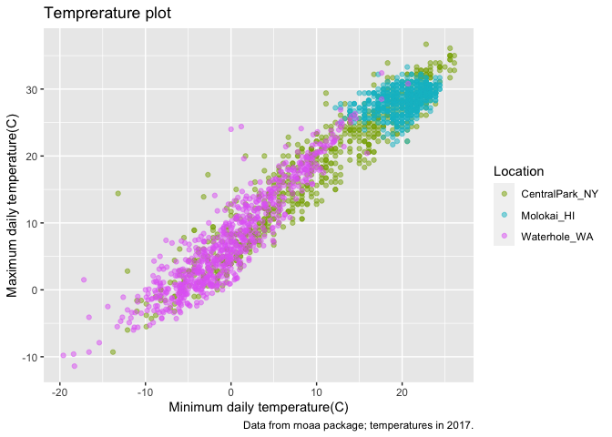

Visualization 2
================
Esther Kyeremah
2023-10-23

``` r
library(tidyverse)
```

    ## ── Attaching core tidyverse packages ──────────────────────── tidyverse 2.0.0 ──
    ## ✔ dplyr     1.1.3     ✔ readr     2.1.4
    ## ✔ forcats   1.0.0     ✔ stringr   1.5.0
    ## ✔ ggplot2   3.4.3     ✔ tibble    3.2.1
    ## ✔ lubridate 1.9.2     ✔ tidyr     1.3.0
    ## ✔ purrr     1.0.2     
    ## ── Conflicts ────────────────────────────────────────── tidyverse_conflicts() ──
    ## ✖ dplyr::filter() masks stats::filter()
    ## ✖ dplyr::lag()    masks stats::lag()
    ## ℹ Use the conflicted package (<http://conflicted.r-lib.org/>) to force all conflicts to become errors

``` r
library(ggridges)
```

``` r
weather_df = 
  rnoaa::meteo_pull_monitors(
    c("USW00094728", "USW00022534", "USS0023B17S"),
    var = c("PRCP", "TMIN", "TMAX"), 
    date_min = "2021-01-01",
    date_max = "2022-12-31") |>
  mutate(
    name = recode(
      id, 
      USW00094728 = "CentralPark_NY", 
      USW00022534 = "Molokai_HI",
      USS0023B17S = "Waterhole_WA"),
    tmin = tmin / 10,
    tmax = tmax / 10) |>
  select(name, id, everything())
```

    ## using cached file: /Users/ESTER1/Library/Caches/org.R-project.R/R/rnoaa/noaa_ghcnd/USW00094728.dly

    ## date created (size, mb): 2023-10-22 18:36:33.146851 (8.534)

    ## file min/max dates: 1869-01-01 / 2023-10-31

    ## using cached file: /Users/ESTER1/Library/Caches/org.R-project.R/R/rnoaa/noaa_ghcnd/USW00022534.dly

    ## date created (size, mb): 2023-10-22 18:37:04.899569 (3.839)

    ## file min/max dates: 1949-10-01 / 2023-10-31

    ## using cached file: /Users/ESTER1/Library/Caches/org.R-project.R/R/rnoaa/noaa_ghcnd/USS0023B17S.dly

    ## date created (size, mb): 2023-10-22 18:37:14.53003 (0.997)

    ## file min/max dates: 1999-09-01 / 2023-10-31

``` r
weather_df %>% 
  ggplot(aes(x = tmin, y = tmax, color = name)) +
  geom_point(alpha = .5)
```

    ## Warning: Removed 17 rows containing missing values (`geom_point()`).

<!-- -->

\#Labels

``` r
weather_df %>% 
  ggplot(aes(x = tmin, y = tmax, color = name)) +
  geom_point(alpha = .5) +
  labs( 
    title = "Temprerature plot",
    x = "Minimum daily temperature(C)",
    y = "Maximum daily temperature(C)",
    caption = "Data from rnoaa package; temperatures in 2017."
    ) +
  scale_x_continuous(
    breaks = c(-15, 0 , 15),
    labels = c("-15C", "OC", "15C")) + 
  scale_y_continuous(
    trans = "sqrt",
    position = "right"
  )
```

    ## Warning in self$trans$transform(x): NaNs produced

    ## Warning: Transformation introduced infinite values in continuous y-axis

    ## Warning: Removed 142 rows containing missing values (`geom_point()`).

<!-- -->

Look at color scales and change the variable key name to LOCATION

``` r
weather_df %>% 
  ggplot(aes(x = tmin, y = tmax, color = name)) +
  geom_point(alpha = .5) +
  labs( 
    title = "Temprerature plot",
    x = "Minimum daily temperature(C)",
    y = "Maximum daily temperature(C)",
    caption = "Data from rnoaa package; temperatures in 2017." ) +
  scale_color_hue(
   name = "Location",
    h = c(100,300))
```

    ## Warning: Removed 17 rows containing missing values (`geom_point()`).

<!-- -->

Using viridis

``` r
weather_df %>% 
  ggplot(aes(x = tmin, y = tmax, color = name)) +
  geom_point(alpha = .5) +
  labs( 
    title = "Temprerature plot",
    x = "Minimum daily temperature(C)",
    y = "Maximum daily temperature(C)",
    caption = "Data from rnoaa package; temperatures in 2017." ) +
    viridis::scale_color_viridis(
      name = "Location",
   discrete = TRUE)
```

    ## Warning: Removed 17 rows containing missing values (`geom_point()`).

<!-- -->

\##Themes The theme legend position has to come after youve chosen to
use theme_minmal..other theems are theme_classic etc… you can also use
ggthemes::(and then pick from he options)

``` r
weather_df %>% 
  ggplot(aes(x = tmin, y = tmax, color = name)) +
  geom_point(alpha = .5) +
  labs( 
    title = "Temprerature plot",
    x = "Minimum daily temperature(C)",
    y = "Maximum daily temperature(C)",
    caption = "Data from rnoaa package; temperatures in 2017." ) +
    viridis::scale_color_viridis(
      name = "Location",
   discrete = TRUE) +
theme_minimal() +
theme(legend.position = "bottom")
```

    ## Warning: Removed 17 rows containing missing values (`geom_point()`).

<!-- -->

\##Setting options

``` r
library(tidyverse)

knitr::opts_chunk$set(
  fig.width = 6,
  gif.asp = .6,
  out.width = "90%"
)


theme_set(theme_minimal() + theme(legend.position = "bottom"))

options(
  ggplot2.comtinuous.colour = "viridis",
  ggplot2.continuous.fill = "viridis"
)

scale_colour_discrete = scale_color_viridis_d
scale_fill_discrete = scale_fill_viridis_d
```

## Data args in `geom`

``` r
 central_park = 
  weather_df %>% 
  filter(name == "CentralPark_NY")


Molokai = 
   weather_df %>% 
  filter(name == "Molokai_HI")


ggplot(data = Molokai, aes(x = date, y = tmax, color = name)) +
geom_point() +
  geom_line()
```

    ## Warning: Removed 1 rows containing missing values (`geom_point()`).

<!-- -->
if i want to use one data set for geom point and another dataset for
geom line you can specify

``` r
ggplot(data = Molokai, aes(x = date, y = tmax, color = name)) +
geom_point() +
geom_line(data = central_park)
```

    ## Warning: Removed 1 rows containing missing values (`geom_point()`).

<!-- -->

\## `patchmark`

``` r
weather_df %>% 
  ggplot(aes(x = tmin, fill = name)) +
geom_density(alpha = .5) +
facet_grid(. ~ name)
```

    ## Warning: Removed 17 rows containing non-finite values (`stat_density()`).

<!-- -->

what happens when you want multipanel plots but cannot facet?

``` r
tmin_tmax =
  weather_df %>% 
  ggplot(aes(x = tmin, y = tmax, color = name)) +
  geom_point(alpha = .5) +
  theme(legend.position = "none") 

 prcp_dens_plot =
  weather_df %>% 
  filter(prcp > 0) %>% 
  ggplot(aes(x = prcp, fill = name)) +
  geom_density(alpha = .5) +
  theme(legend.position = "none") 
 
 tmax_date_p =
  weather_df %>% 
  filter(prcp > 0) %>% 
  ggplot(aes(x = date, y = tmax, color = name)) +
  geom_point() +
geom_smooth(se = FALSE) +
  theme(legend.position = "none") 

library(patchwork)
tmax_date_p + prcp_dens_plot
```

    ## `geom_smooth()` using method = 'loess' and formula = 'y ~ x'

    ## Warning: Removed 2 rows containing non-finite values (`stat_smooth()`).

    ## Warning: Removed 2 rows containing missing values (`geom_point()`).

<!-- -->
